# SmartQA 系统架构设计文档


| 文档版本 | 日期         | 作者          | 变更说明                                   |
| ---- | ---------- | ----------- | -------------------------------------- |
| v1.0 | 2026-05-28 | SmartQA 项目组 | 初始版本，描述 V1.0 单机架构与模块设计；对齐当前代码基线 v0.1.0 |


> **阅读说明：** 本文档以 **V1.0 单机基石版** 为目标架构。文中用 **【已实现 v0.1】** / **【规划 V1.0】** 标注与当前仓库的差异，避免设计与代码脱节。

---

## 1. 引言

### 1.1 项目背景

企业内部知识散落在各类文档（政策、技术方案、操作手册）中，员工查找费时费力。**SmartQA** 旨在构建智能知识库问答系统，支持文档上传、语义搜索以及基于大模型的智能问答，最终实现企业知识的便捷获取。

**【已实现 v0.1】** 已完成用户注册登录、文档上传落盘、问答社区（问题 / 回答）等基础 REST API，可通过 Swagger UI / Postman 联调。  
**【规划 V1.0+】** 文档正文解析、JWT 鉴权、统一异常处理；**V3.0** 起接入 RAG 与向量检索。

### 1.2 设计目标


| 目标            | 说明                                                       |
| ------------- | -------------------------------------------------------- |
| **MVP（V1.0）** | 快速实现核心业务流程（文档管理、基础问答），同时兼顾技术学习目标（JVM、并发、数据库调优、Spring 实践） |
| **可演进性**      | 单体架构内模块化分层，为后续拆分为微服务、引入 AI 能力做好准备                        |
| **可观测性**      | 从 V1.0 起预留监控与诊断点（日志、指标、Arthas），养成性能意识                    |


### 1.3 技术选型

#### 1.3.1 当前基线（v0.1.0，与 `pom.xml` 一致）


| 类别       | 技术                         | 版本 / 说明     |
| -------- | -------------------------- | ----------- |
| 语言 / 运行时 | Java                       | **21**      |
| 核心框架     | Spring Boot                | **3.5.14**  |
| Web      | Spring MVC、Bean Validation | —           |
| 持久化      | Spring Data JPA、Hibernate  | —           |
| 数据库      | PostgreSQL                 | 15+（本地安装）   |
| 安全（局部）   | `spring-security-crypto`   | BCrypt 密码编码 |
| API 文档   | springdoc-openapi          | 2.2.0       |
| 工具       | Lombok、DevTools            | —           |


#### 1.3.2 V1.0 目标选型（在 v0.1 基础上扩展）


| 类别    | 技术                       | 说明                 |
| ----- | ------------------------ | ------------------ |
| 文档解析  | Apache PDFBox、Apache POI | PDF / Word 文本抽取    |
| 认证授权  | Spring Security + JWT    | 替换 UUID 占位 Token   |
| 前端    | Next.js + Ant Design     | `frontend/` 目录，规划中 |
| 数据库编排 | Docker Compose           | 本地 PostgreSQL 容器化  |
| 连接池   | HikariCP                 | Spring Boot 默认集成   |


#### 1.3.3 环境与工具链约束


| 约束项       | 说明                                                          |
| --------- | ----------------------------------------------------------- |
| 本地依赖与数据目录 | 建议统一存放于 `E:\home`（如 JDK、PostgreSQL 数据目录、Docker 卷），避免污染系统盘   |
| 上传文件目录    | 默认 `uploads/`（配置项 `smartqa.upload-dir`），相对路径解析为应用运行目录下的绝对路径 |
| 开发 OS     | Windows 10+（当前主力环境）；部署说明兼顾 Docker                           |


> 注：模板初稿中的 Java 26、Spring Boot 3.2 已按仓库实际版本修正为 **Java 21 / Spring Boot 3.5.14**。

---

## 2. 总体架构

### 2.1 V1.0 单体架构概览

V1.0 采用 **单体分层架构**，在单一 Spring Boot 应用中完成全部业务功能。内部按职责划分包结构，为后续微服务拆分做铺垫。  
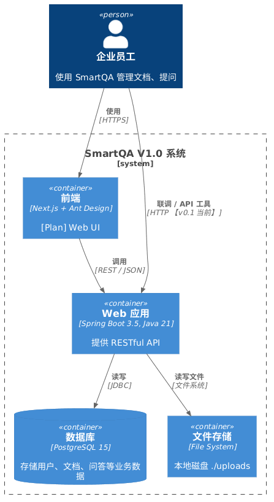
> 上图由 PlantUML 渲染导出；下方保留源码，便于修改后重新生成。

```plantuml
@startuml
!include <C4/C4_Container>
!include <C4/C4_Context>

Person(user, "企业员工", "使用 SmartQA 管理文档、提问")

System_Boundary(smartqa, "SmartQA V1.0 系统") {
    Container(web_app, "Web 应用", "Spring Boot 3.5, Java 21", "提供 RESTful API")
    ContainerDb(postgres, "数据库", "PostgreSQL 15", "存储用户、文档、问答等业务数据")
    ContainerFs(file_storage, "文件存储", "本地磁盘 ./uploads", "存放用户上传的原始文档")
    Container(frontend, "前端", "Next.js + Ant Design", "【规划】Web 界面")
}

Rel(user, frontend, "使用", "HTTPS")
Rel(frontend, web_app, "调用", "REST / JSON")
Rel(user, web_app, "联调 / API 工具", "HTTP 【v0.1 当前】")
Rel(web_app, postgres, "读写", "JDBC")
Rel(web_app, file_storage, "读写文件", "文件系统")

@enduml
```

**组件说明：**


| 组件             | 职责                                                                                |
| -------------- | --------------------------------------------------------------------------------- |
| **Web 应用**     | 包含 Controller → Service → Repository 分层；V1.0 增加 `infrastructure` 包承载解析、存储、安全等横切能力 |
| **PostgreSQL** | 持久化结构化数据；**未启用** pgvector（V3.0 向量检索预留）                                            |
| **文件存储**       | 原始文档落盘；上传时使用 **UUID + 原扩展名** 重命名，防止冲突                                             |
| **前端**         | V1.0 规划；v0.1 通过 Swagger UI（`http://localhost:8080/swagger-ui.html`）联调             |


### 2.2 应用内部分层架构

**【已实现 v0.1】** 包结构：`controller` / `service` / `repository` / `entity` / `dto` / `config`。

**【规划 V1.0】** 新增 `infrastructure`（及可选 `common` 统一响应、异常）。

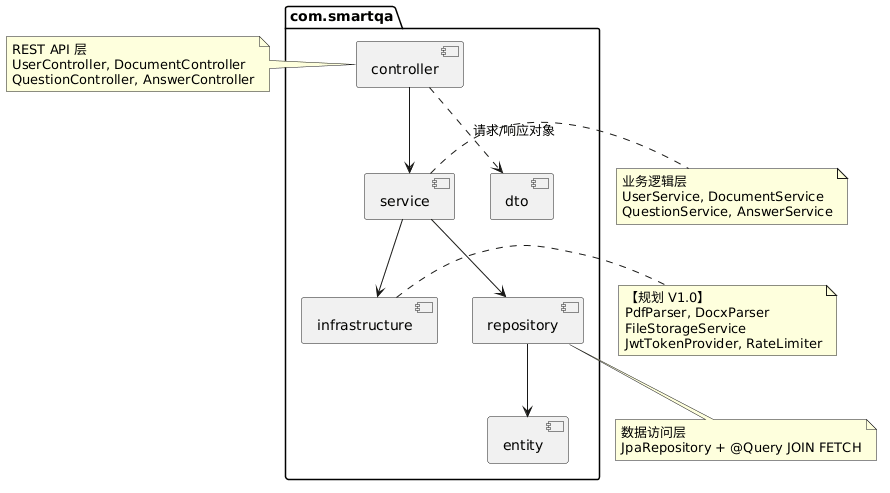
> 上图由 PlantUML 渲染导出；下方保留源码，便于修改后重新生成。

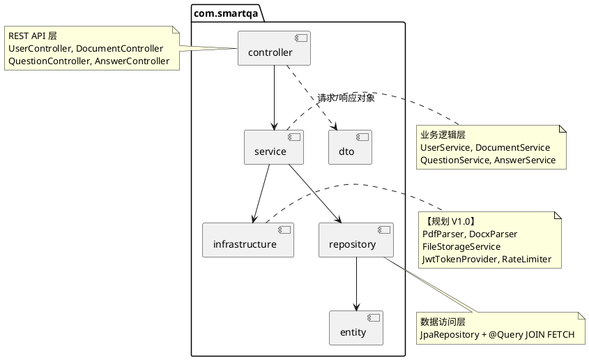


| 分层                 | 职责                                       | v0.1 现状    |
| ------------------ | ---------------------------------------- | ---------- |
| **controller**     | 接收 HTTP 请求，`@Valid` 参数校验，调用 service，返回响应 | ✅ 已实现      |
| **service**        | 核心业务逻辑、`@Transactional` 事务、协调 repository | ✅ 已实现      |
| **repository**     | Spring Data JPA 数据访问                     | ✅ 已实现      |
| **entity**         | JPA 实体，映射 `t_`* 表                        | ✅ 已实现      |
| **dto**            | 与 API 绑定的请求体，与实体分离                       | ✅ 已实现      |
| **config**         | Bean 配置（如 `BCryptPasswordEncoder`）       | ✅ 已实现      |
| **infrastructure** | 文档解析、文件存储抽象、JWT、限流等                      | 📋 V1.0 规划 |


### 2.3 仓库目录结构

```
smart-qa/
├── src/main/java/com/smartqa/
│   ├── SmartqaApplication.java
│   ├── config/           # SecurityConfig 等
│   ├── controller/
│   ├── dto/
│   ├── entity/
│   ├── repository/
│   ├── service/
│   └── infrastructure/   # 【规划 V1.0】
├── src/main/resources/
│   └── application.yml
├── frontend/             # 【规划】Next.js
├── notes/                # 阶段总结
├── docs/                 # 设计文档（本文档）
├── uploads/              # 运行时生成，上传文件目录
└── docker-compose.yml    # 【规划 V1.0】PostgreSQL
```

---

## 3. 核心模块设计

### 3.1 用户模块


| 项目       | 说明                                                                                                                                                 |
| -------- | -------------------------------------------------------------------------------------------------------------------------------------------------- |
| **实体**   | `User` → 表 `t_user`：`id`, `username`, `password`, `email`, `role`, `createdAt`, `updatedAt`                                                        |
| **API**  | `POST /api/users/register` 注册 【已实现】 `POST /api/users/login` 登录 【已实现】                                                                               |
| **安全机制** | 密码 **BCrypt** 加密存储（`SecurityConfig` 注册 `BCryptPasswordEncoder`）【已实现】 登录返回 **UUID 占位 Token**，未做请求鉴权 【v0.1】 **JWT + Spring Security 过滤器链** 【规划 V1.0】 |
| **主要流程** | 注册：校验用户名唯一 → 加密密码 → 持久化 登录：按用户名查询 → `matches` 校验密码 → 返回 `{ token, username }`                                                                      |


**序列图（注册）：**
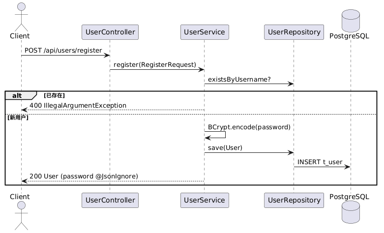
> 上图由 PlantUML 渲染导出；下方保留源码，便于修改后重新生成。

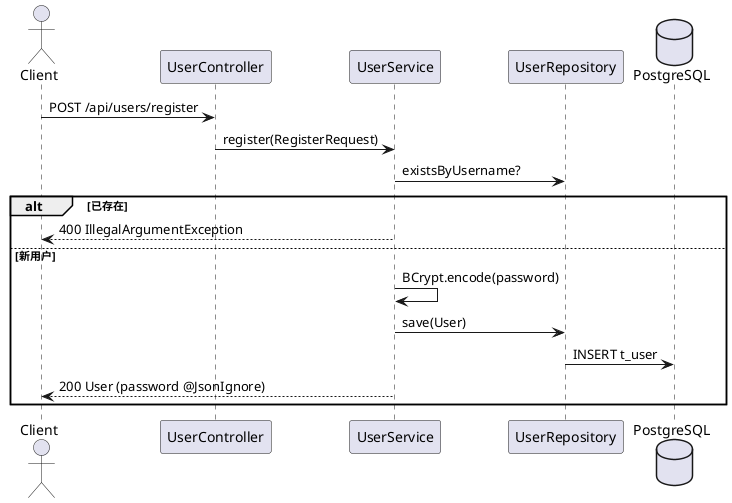

### 3.2 文档模块


| 项目       | 说明                                                                                                                |
| -------- | ----------------------------------------------------------------------------------------------------------------- |
| **实体**   | `Document` → 表 `t_document`：`id`, `title`, `filePath`, `content`, `fileType`, `status`, `uploadedBy`, `createdAt` |
| **API**  | `POST /api/documents/upload` 【已实现】 `GET /api/documents` 列表 【规划 V1.0】 `GET /api/documents/{id}` 详情 【规划 V1.0】       |
| **文件存储** | 保存至 `{upload-dir}/{uuid}{ext}`，库中存相对文件名；默认目录 `uploads/`                                                           |
| **上传参数** | `multipart/form-data`：`file`, `title`, `userId`                                                                   |
| **大小限制** | 单文件 / 请求最大 **50MB**（`application.yml`）                                                                            |


**解析流程（V1.0 目标）：**解析流程（V1.0 解析流程）
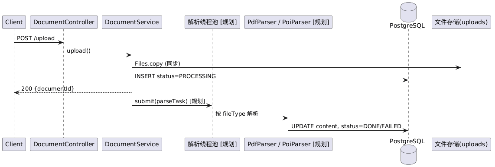
> 上图由 PlantUML 渲染导出；下方保留源码，便于修改后重新生成。

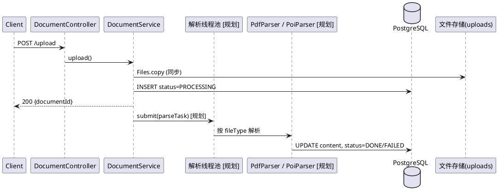


| 设计要点                                            | 状态             |
| ----------------------------------------------- | -------------- |
| 上传接口立即返回 `documentId`，解析异步执行                    | 【规划 V1.0】      |
| 自定义线程池 + 队列上限，避免大文件并发 OOM                       | 【规划 V1.0】      |
| 基于 AQS 的手写限流器，保护上传接口（如 QPS ≤ 10）                | 【规划 V1.0，学习目标】 |
| v0.1 上传后 `status` 固定为 `PROCESSING`，`content` 为空 | 【当前行为】         |


### 3.3 问答模块


| 项目       | 说明                                                                                                                                                                                                            |
| -------- | ------------------------------------------------------------------------------------------------------------------------------------------------------------------------------------------------------------- |
| **实体**   | `Question` → `t_question`；`Answer` → `t_answer`                                                                                                                                                               |
| **API**  | `POST /api/questions` 提问 【已实现】 `GET /api/questions` 列表（含提问人）【已实现】 `GET /api/questions/{id}` 详情 【已实现】 `POST /api/questions/{questionId}/answers` 回答 【已实现】 `GET /api/questions/{questionId}/answers` 回答列表 【已实现】 |
| **流程**   | 创建问题 / 回答前校验 `userId` 存在；通过 `@ManyToOne` 关联 `User`                                                                                                                                                            |
| **查询优化** | `QuestionRepository` / `AnswerRepository` 使用 `JOIN FETCH` 预加载关联用户，避免懒加载与 JSON 序列化问题 【已实现】                                                                                                                     |
| **扩展点**  | `Answer.content` 可存 Markdown；V3.0 AI 生成答案写入同表                                                                                                                                                                 |


**实体关系（问答域）：**
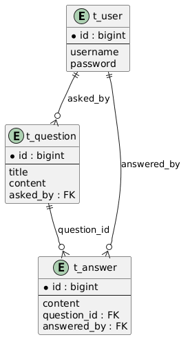
> 上图由 PlantUML 渲染导出；下方保留源码，便于修改后重新生成。

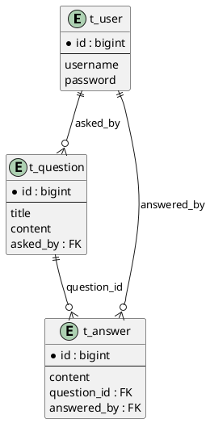

---

## 4. 数据库设计

### 4.1 ER 关系

```
user (1) ──── (*) document     上传文档
user (1) ──── (*) question     提出问题
user (1) ──── (*) answer       提供回答
question (1) ──── (*) answer   问题下的多个回答
```

### 4.2 核心表结构

> v0.1 由 JPA `ddl-auto: update` 自动建表；下表为逻辑模型，物理列名遵循 Hibernate 默认命名（如 `created_at`）。

#### `t_user`


| 字段         | 类型           | 约束               | 说明               |
| ---------- | ------------ | ---------------- | ---------------- |
| id         | bigserial    | PK               | 主键               |
| username   | varchar      | unique, not null | 用户名              |
| password   | varchar(255) | not null         | BCrypt 密文        |
| email      | varchar      |                  | 邮箱               |
| role       | varchar(50)  | default `'USER'` | USER / ADMIN（预留） |
| created_at | timestamp    |                  | 创建时间             |
| updated_at | timestamp    |                  | 更新时间             |


#### `t_document`


| 字段          | 类型          | 约束                   | 说明                         |
| ----------- | ----------- | -------------------- | -------------------------- |
| id          | bigserial   | PK                   | 主键                         |
| title       | varchar     | not null             | 文档标题                       |
| file_path   | varchar     | not null             | 存储文件名（UUID+扩展名）            |
| content     | text        |                      | 解析后正文 【V1.0 填充】            |
| file_type   | varchar     |                      | 如 `.pdf`、`.docx`           |
| status      | varchar(50) | default `PROCESSING` | PROCESSING / DONE / FAILED |
| uploaded_by | bigint      | FK → t_user.id       | 上传者                        |
| created_at  | timestamp   |                      | 上传时间                       |


#### `t_question`


| 字段         | 类型        | 约束             | 说明   |
| ---------- | --------- | -------------- | ---- |
| id         | bigserial | PK             | 主键   |
| title      | varchar   | not null       | 问题标题 |
| content    | text      |                | 问题正文 |
| asked_by   | bigint    | FK → t_user.id | 提问者  |
| created_at | timestamp |                | 创建时间 |


#### `t_answer`


| 字段          | 类型        | 约束                 | 说明   |
| ----------- | --------- | ------------------ | ---- |
| id          | bigserial | PK                 | 主键   |
| content     | text      |                    | 回答正文 |
| question_id | bigint    | FK → t_question.id | 所属问题 |
| answered_by | bigint    | FK → t_user.id     | 回答者  |
| created_at  | timestamp |                    | 创建时间 |


### 4.3 索引与连接池（V1.0 规划）


| 项    | 建议                                                                     |
| ---- | ---------------------------------------------------------------------- |
| 索引   | `t_user.username`（唯一已有）、`t_document.uploaded_by`、`t_question.asked_by` |
| 连接池  | HikariCP（Spring Boot 默认），按并发调优 `maximum-pool-size`                     |
| 迁移工具 | 生产改用 Flyway / Liquibase，替代 `ddl-auto: update`                          |


### 4.4 数据源配置（当前）

```yaml
# src/main/resources/application.yml（摘要）
spring:
  datasource:
    url: jdbc:postgresql://localhost:5432/smartqa
    username: postgres
    password: 123456   # 本地开发，勿提交生产密钥
  jpa:
    hibernate:
      ddl-auto: update
smartqa:
  upload-dir: uploads
```

---

## 5. API 设计汇总

基础路径：`http://localhost:8080`


| 模块  | 方法   | 路径                                    | 状态      |
| --- | ---- | ------------------------------------- | ------- |
| 用户  | POST | `/api/users/register`                 | ✅       |
| 用户  | POST | `/api/users/login`                    | ✅       |
| 文档  | POST | `/api/documents/upload`               | ✅       |
| 文档  | GET  | `/api/documents`                      | 📋 V1.0 |
| 文档  | GET  | `/api/documents/{id}`                 | 📋 V1.0 |
| 问答  | POST | `/api/questions`                      | ✅       |
| 问答  | GET  | `/api/questions`                      | ✅       |
| 问答  | GET  | `/api/questions/{id}`                 | ✅       |
| 问答  | POST | `/api/questions/{questionId}/answers` | ✅       |
| 问答  | GET  | `/api/questions/{questionId}/answers` | ✅       |


**统一响应体（规划 V1.0）：**

```json
{
  "code": 0,
  "message": "success",
  "data": { }
}
```

配合 `@ControllerAdvice` 将 `IllegalArgumentException` 等业务异常映射为 4xx 与统一 JSON（v0.1 尚未实现，异常可能直接 500）。

---

## 6. 安全与性能设计

### 6.1 安全


| 项    | v0.1                              | V1.0 目标                    |
| ---- | --------------------------------- | -------------------------- |
| 认证   | UUID Token，无拦截校验                  | JWT + Spring Security 过滤器链 |
| 密码   | BCrypt（`BCryptPasswordEncoder`）   | 保持，强度默认 10                 |
| 输入校验 | `@Valid` + JSR 303（`@NotBlank` 等） | 扩展更多字段规则                   |
| 敏感字段 | `User.password` `@JsonIgnore`     | 保持                         |
| 接口鉴权 | 业务层显式传 `userId`                   | Token 解析当前用户               |


### 6.2 性能


| 项      | 说明                           | 状态            |
| ------ | ---------------------------- | ------------- |
| 异步文档解析 | 上传接口快速返回，解析在独立线程池            | 📋 V1.0       |
| 上传限流   | 手写 AQS 限流器，峰值 QPS 约 10（学习并发） | 📋 V1.0       |
| 数据库    | 高频字段索引；HikariCP 连接池          | 📋 V1.0 调优    |
| JVM 诊断 | Arthas 分析堆、GC、热点方法           | 📋 V1.0 实践    |
| 懒加载    | `JOIN FETCH` + 只读事务          | ✅ v0.1 问答列表已用 |


---

## 7. 部署视图（V1.0）
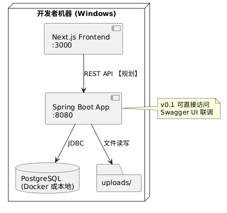
> 上图由 PlantUML 渲染导出；下方保留源码，便于修改后重新生成。

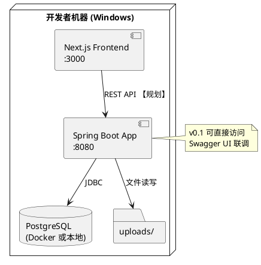

### 7.1 部署步骤

**v0.1（当前最小路径）：**

1. 创建数据库：`CREATE DATABASE smartqa;`
2. 修改 `application.yml` 中数据源账号密码
3. 仓库根目录执行：`.\mvnw spring-boot:run`
4. 打开 `http://localhost:8080/swagger-ui.html`

**V1.0（目标）：**

1. `docker-compose up -d` 启动 PostgreSQL（数据卷挂载至 `E:\home\...`）
2. 启动 Spring Boot 应用
3. `cd frontend && npm run dev` 启动 Next.js
4. 访问 `http://localhost:3000`

### 7.2 配置清单


| 配置项                                      | 默认值       | 说明         |
| ---------------------------------------- | --------- | ---------- |
| `server.port`                            | 8080      | 后端端口       |
| `smartqa.upload-dir`                     | `uploads` | 上传目录       |
| `spring.servlet.multipart.max-file-size` | 50MB      | 单文件上限      |
| `spring.jpa.hibernate.ddl-auto`          | `update`  | 开发环境自动 DDL |


---

## 8. 演进规划

与 README 路线图一致：


| 版本       | 架构变化     | 新增能力                                   | 状态        |
| -------- | -------- | -------------------------------------- | --------- |
| **V0.1** | 单体 + JPA | 用户 / 文档上传 / 问答 CRUD、Swagger            | ✅ 已发布 Tag |
| **V1.0** | 单体工程化增强  | JWT、统一异常、文档解析、文档列表 API、前端雏形            | 📋 进行中    |
| **V2.0** | 微服务拆分    | Nacos、Gateway、OpenFeign、RocketMQ、Redis | 📋        |
| **V3.0** | AI 服务层   | LangChain4j / Spring AI、RAG、pgvector   | 📋        |
| **V4.0** | 云原生      | Docker/K8s、Prometheus、Grafana、链路追踪     | 📋        |

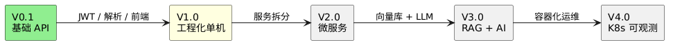
> 上图由 PlantUML 渲染导出；下方保留源码，便于修改后重新生成。

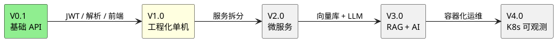

---

## 9. 附录

### 9.1 如何生成架构图

**方式一：PlantUML 在线渲染**

1. 复制本文档中 `@startuml` … `@enduml` 代码块
2. 打开 [PlantUML 在线编辑器](https://www.plantuml.com/plantuml/uml/)
3. 粘贴代码，导出 PNG / SVG

**方式二：IDE / CLI**

- VS Code 安装 PlantUML 插件，或本地 `java -jar plantuml.jar docs/design-v1.md`

**方式三：Draw.io**

根据 C4 图与 ER 描述手动画图，导出至 `docs/architecture-v1.png`，并在 README 中引用。

### 9.2 v0.1 与 V1.0 能力对照表


| 能力               | v0.1.0 | V1.0 设计目标 |
| ---------------- | ------ | --------- |
| 用户注册 / 登录        | ✅      | ✅ + JWT   |
| 文档上传             | ✅      | ✅ + 异步解析  |
| 文档列表 / 详情        | ❌      | ✅         |
| 问答 CRUD          | ✅      | ✅         |
| 全局异常 / 统一 Result | ❌      | ✅         |
| infrastructure 包 | ❌      | ✅         |
| 上传限流（AQS）        | ❌      | ✅（学习项）    |
| Next.js 前端       | ❌      | ✅         |
| docker-compose   | ❌      | ✅         |
| Swagger          | ✅      | ✅         |


### 9.3 相关文档


| 文档        | 路径                     |
| --------- | ---------------------- |
| 项目说明      | `README.md`            |
| v0.1 阶段总结 | `notes/v0.1.0_阶段总结.md` |
| OpenAPI   | 运行时 `/v3/api-docs`     |


---

*文档维护：每完成一个版本 Tag，同步更新「能力对照表」与 PlantUML 注释中的实现状态。*